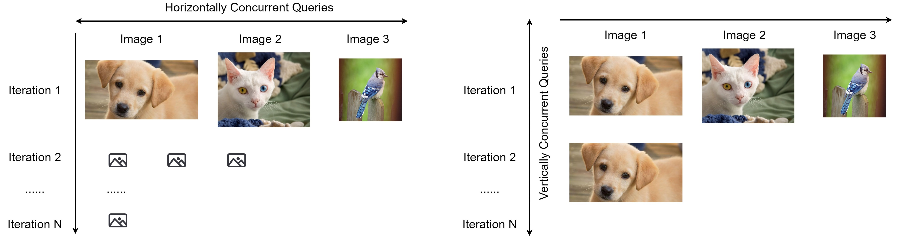

## Adversarial Classification

> Distributed Black-Box attacks against Image Classification.

[[ Talk ]](https://distributed.wuhanstudio.uk) [[ Video ]]() [[ Paper ]](https://arxiv.org/abs/2210.16371) [[ Code ]](https://github.com/wuhanstudio/adversarial-classification)

Whether black-box attacks have become a real threat against image classification cloud services? Our research demonstrates that it is possible to exploit the load balancer to accelerate black-box attacks.

We open-source our image classification cloud service, [DeepAPI](https://github.com/wuhanstudio/deepapi), to facilitate future research on distributed blackbox attacks that bring adversarial attacks closer to being a practical threat against machine learning models deployed on cloud servers.




### Quick Start

You may use [anaconda](https://www.continuum.io/downloads) or [miniconda](https://conda.io/miniconda.html). 

```python
$ git clone https://github.com/wuhanstudio/adversarial-classification
$ cd adversarial-classification

$ # CPU
$ conda env create -f environment.yml
$ conda activate adversarial-classification

$ # GPU
$ conda env create -f environment_gpu.yml
$ conda activate adversarial-gpu-classification
```

## Citation

```
@misc{han2022class,
  doi = {10.48550/ARXIV.2210.16371},
  url = {https://arxiv.org/abs/2210.16371},
  author = {Wu, Han and Rowlands, Sareh and Wahlstrom, Johan},
  title = {Distributed Black-box Attack against Image Classification Cloud Services},
  publisher = {arXiv},
  year = {2022}
}
```
